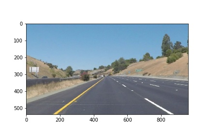
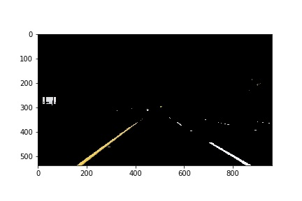
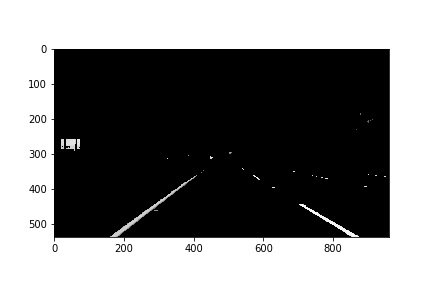
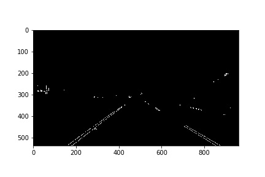
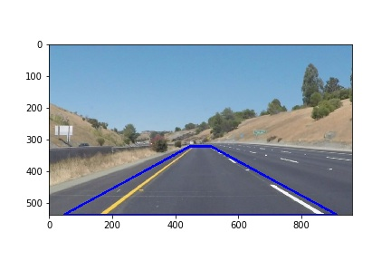
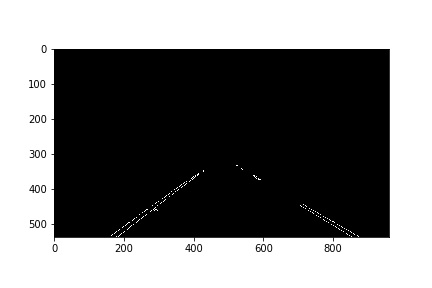
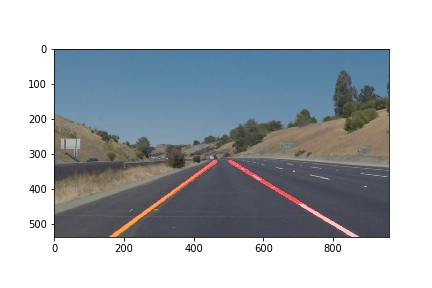

# Finding Lane Lines on the Road

## Project goal and description

The goal of the project is to make a pipeline that is capable of detecting lanelines from both images and videos. Main techniques used in this project are: Canny edge detection and Hough transformation. The pipeline is facilitated through OpenCV libarary and python 3.6 environment. The implemented pipeline sucessfully dectects the lanelines with various images and videos taken from vehicle driving on the highway(see results in the folder test_images/videos_output).

## Description of the pipeline
An example of the original image for example is shown as bellow:

---

The pipeline includes 5 steps: 

1. The input image is first filtered with a yellow/white filter so that everything that's not yellow or white will be filtered out and "painted" black. This is particularly useful for the challenging problem, sicne there are other nuance features such as shadows, trees and side fences. After applying the filter, example image will look like the following:

---

2. The filtered image is then converted into gray scale: 

---

3. Next, the above image is filtered again by a gaussian blur filter for smoothing and is then applied with Canny edge detector:

---

4. Output image is then filtered with a mask focusing only on area inside a trapezoid region. Image below shows the trapezoid region, highlighted with blue lines. As depicted by the image, lanelines that need to be detected all lies inside the trapeziod.

---

   Applying the mask, output from canny edge detection can be furthur cleaned as follows, leaving only edges that are inside the      region of interest

---

5. These edges are then converted into line segments with Hough transformation. And the segments is then merged into a single laneline. To merge the segments, the helper function draw_line_LS() is used. It first groups the detected segments into left and right groups depending on the slope of line segments. "Bad segments" with small or large slopes are neglected. Then, a least square method is used estimate the slopes and intersections for both left and right lanelines. The predicted lanelines are then plotted on the original image and the final result looks like below: 

---

## Potential shortcomings and suggested improvements
In implementing the pipeline, the biggest short coming is that the parameter tuning can not be automated, particularly in deciding the region of interest. With a change of camera angle and image resolution, for instance for the challening problem, in which image resolution is changed to 1280 by 720 and a portion of the head of the car is captured in the video, parameters suitable for the two previous tests are no longer applicable and requires re-tuning. Additionally, I find that the yellow/white filter is extremely effective on the robustness of the final detection results yet this also introduces another potential shortcomings: the lanelines are required to be of yellow or white colors. The pipline will fail should there be any lanelines of a different color. Lastly, even though the pipeline works ok for the challenging problem for detecting curved lanlines, the pipline can only outputs a straight line estimation and can't follow exactly the laneline. 

Possible improvements include but are not limited to the following

1.  Calculate the fitting error when merging line sgements in step 5 and use higher order fits instead of 1st order when the error is larger than a threshold. Or one can also use generalized Hough transformation to detect curves. 

2. Algorithm for automatic detection on region is interest can be a significant improvements for automated pipeline. This could be done for instance through a calibration stage before starting the car assuming that the angle and resolution will not be changed during the drive.  

